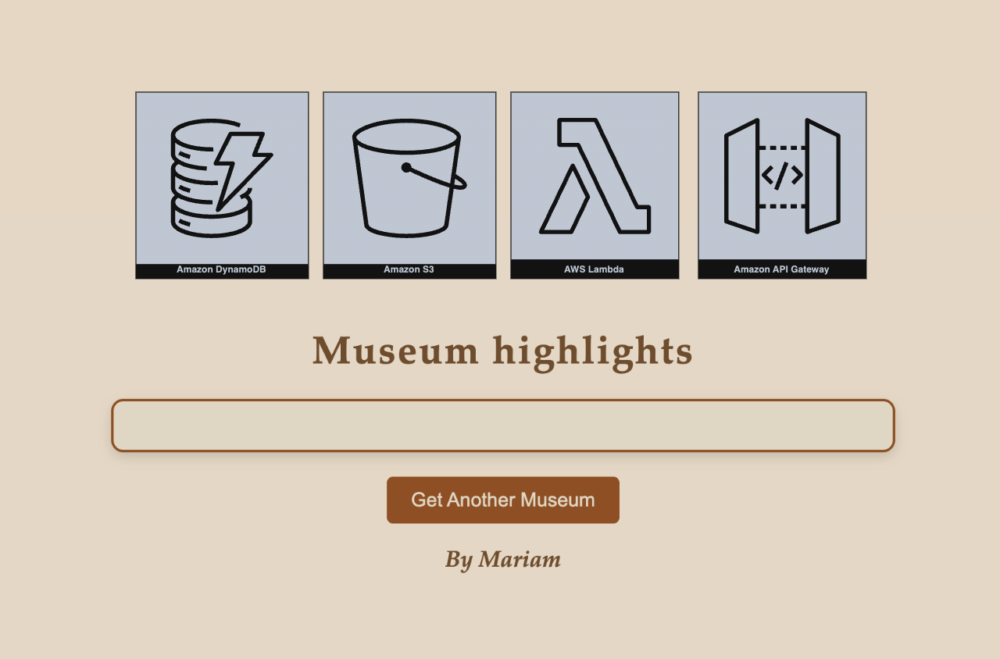
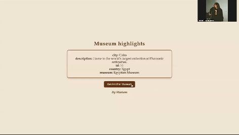

# Museum - AWS

In this project, I created a web application that fetches featured museums from different countries. It traverses the cloud using AWS API Gateway and DynamoDB. This project demonstrates how to leverage cloud technologies to serve dynamic content in a user-friendly way. 

Architecture Diagram

Explanation of the steps

Client interaction: User opens the web application and clicks a button to get a random museum (located anywhere in the world).  

API Gateway: The browser sends an HTTP GET request to the API Gateway.

Lambda function: The API Gateway triggers a Lambda function to handle the request.
DynamoDB query: The Lambda function queries the DynamoDB table to obtain a random cloud definition.

Response: The Lambda function returns the definition to the API Gateway, which sends it back to the client browser for display.
Implementation:

In the final result, we can see how the web uses the resources of Lambda, DynamoDB

